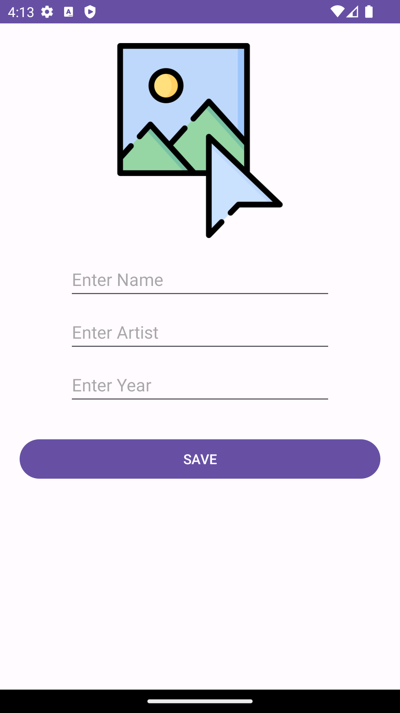
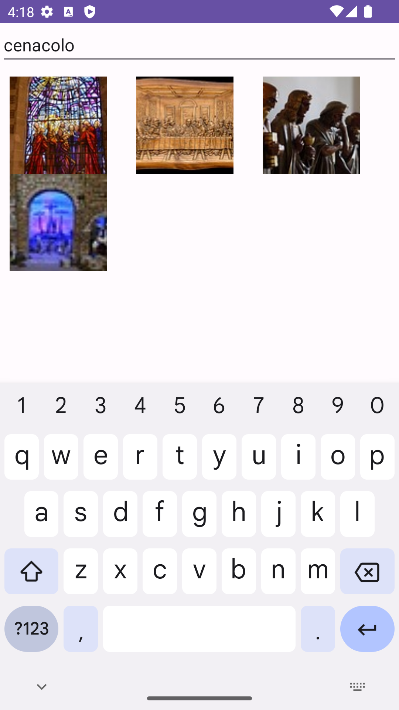
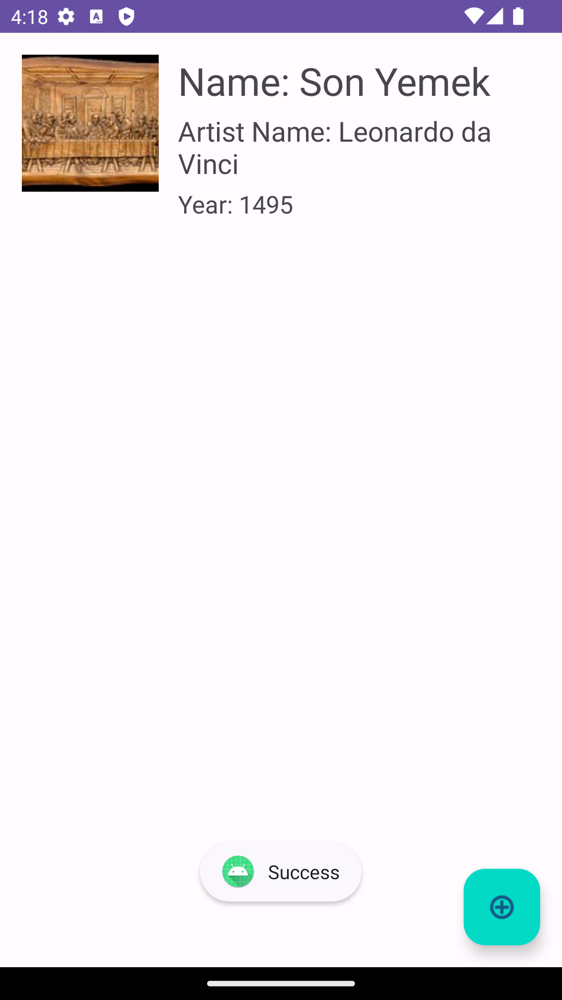

# ArtBookApp

An application that saves famous artworks with their name, artist's name and year of production and displays them in a list.

# Libraries Used
+ MVVM Architecture
+ [Hilt](https://developer.android.com/jetpack/compose/libraries#hilt)
+ [Room](https://developer.android.com/training/data-storage/room)
+ [Navigation Component](https://developer.android.com/guide/navigation/navigation-getting-started)
+ [ViewModel](https://developer.android.com/topic/libraries/architecture/viewmodel#implement)
+ [Coroutines](https://developer.android.com/kotlin/coroutines)
+ [Repositories](https://developer.android.com/topic/architecture#data-layer)
+ [LiveData](https://developer.android.com/topic/libraries/architecture/livedata)
+ [Retrofit](https://square.github.io/retrofit/)
+ [Gson](https://github.com/google/gson)
+ ViewBinding

+ # Output

| --- | --- |
|  | 
|  |
|  |
|  |
